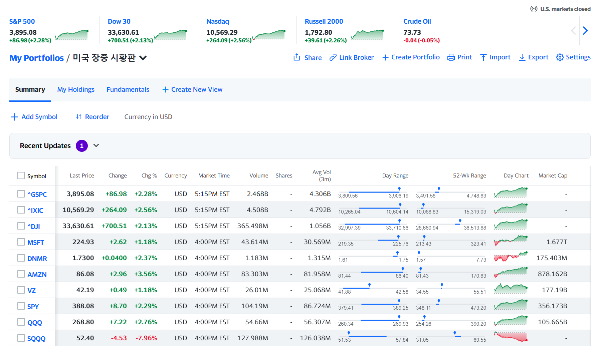
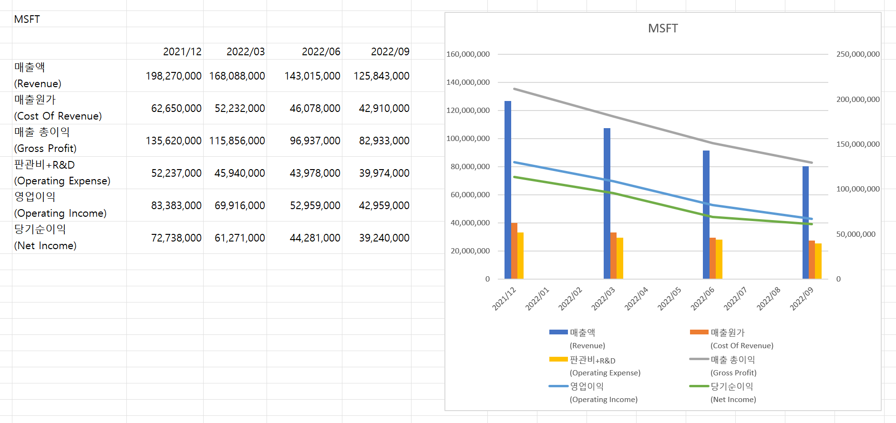
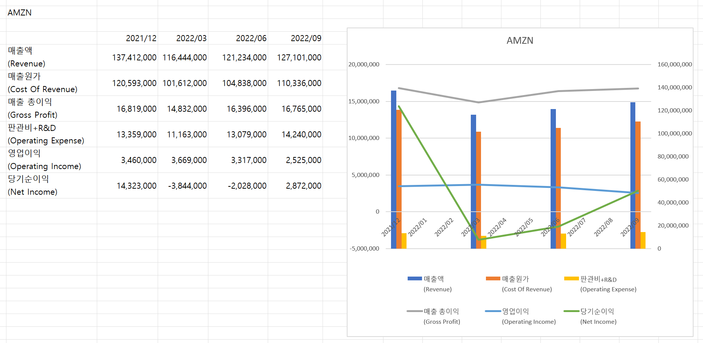
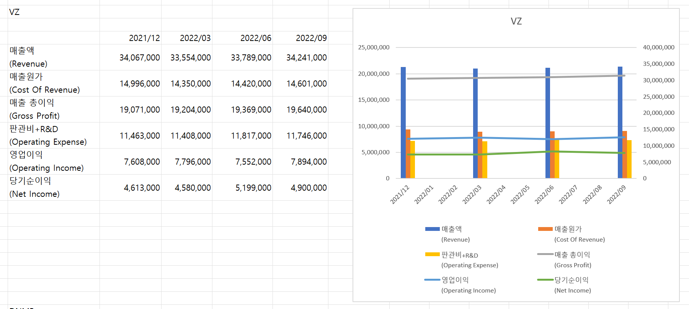

# 2023.01.09 - 잠깐 30분 시간내서 미국주식 시황 정리

나 왜 여기에 정리중인거지? 일단 정리하고 빠르게 시간날때 다른 곳에 정리 ㄱㄱ 

미국 고용은 좋았지만 임금상승률이 낮아서 인플레가 꺾였다는 청신호.

이런 이유로 아래처럼 전약 후강의 강한 거래흐름 발생

그런데 아직은 아래껄로 좋아하긴 아직 설레발.

다음주부터 주요기업 실적발표가 있어서 변동성이 엄청 클것으로 보임.

이번주가 도망칠 기회!!! ㅋㅋ

> 이글을 쓰는 지금도 오르는 척 하다가 다시 또 빠지는 경우가 많다고 이번에도 조심해보는 게 나을것 같다고 연합뉴스 경제 TV에서도 경고해주고 있다.ㅋㅋ

 

 

MSFT

CEO 분이 MSFT 안좋을 것 같다고 이야기했다고 함.

실제로 실적을 찾아서 차트로 그려보니 꽤 나빠진 상태

작년에 돔황쳐서 나왔으니, 올해는 거들떠도 안볼거임.

 

내 경우는 이번 해는 AMZN, VZ 를 나쁘지 않게 보고 있어서 차트를 그려봤다.

단기 고점 찾아서 언제 들어갈지는 계속 고민할 듯

AMZN

 

VZ

그리고 나는 돈못버는 성장주도 조금씩 사고 있다.

2년동안 180만원 부었다.ㅋㅋ 

진짜 깨작깨작 매수하고 있다.

차트는 그려봤는데, 영업이익은 상승했으나, 당기순이익이 떨어진 상태라 어디 투자한건지, 롯데렌탈처럼 다른 기업에 투자한게 가치가 내려간건지 등등 그런 요소들을 검색해볼 예정.